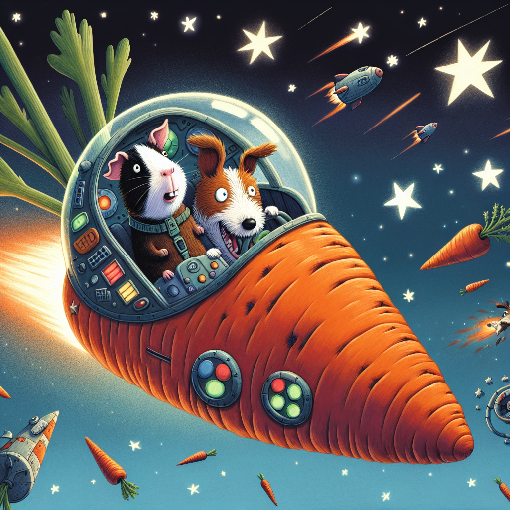

# Kids-AI-Story-Creator
Kid safe short story and related image generator. Good for a classroom setting.


# About

This repo was created to support a class to teach 2nd graders about AI. It uses Google Gemini to create the story and OpenAI DALL-E 3 to generate a story based image. Students can create two characters and select a story location and story style. This pre-defined input combined with LLM safety filters makes it more suitable for the classroom versus more open ended LLM interactions.

The LLM safety filtering is enabled via the built in Gemini controls:

```
safety_settings = {
    HarmCategory.HARM_CATEGORY_HARASSMENT: HarmBlockThreshold.BLOCK_MEDIUM_AND_ABOVE,
    HarmCategory.HARM_CATEGORY_HATE_SPEECH: HarmBlockThreshold.BLOCK_MEDIUM_AND_ABOVE,
    HarmCategory.HARM_CATEGORY_SEXUALLY_EXPLICIT: HarmBlockThreshold.BLOCK_MEDIUM_AND_ABOVE,
    HarmCategory.HARM_CATEGORY_DANGEROUS_CONTENT: HarmBlockThreshold.BLOCK_MEDIUM_AND_ABOVE,
}
```

<br>

# Usage

Install required packages:

```
pip install -r requirements.txt
```

Set your environment variables for Google Cloud and OpenAI:

```
export GCP_PROJECT=
export GCP_REGION=
export OPENAI_API_KEY=
```

This application is deployed as a streamlit web interface. Deploy locally as follows:

```
streamlit run app.py \
  --browser.serverAddress=localhost \
  --server.enableCORS=false \
  --server.enableXsrfProtection=false \
  --server.port 8080
```

To deploy on GCP Cloud Run, update the variables in the script **gcp_cloud_run_deploy.sh** and execute:

```
./gcp_cloud_run_deploy.sh
```

<br>

# Example Story Output:

> 

> In the vast expanse of outer space, two unlikely friends embarked on an unforgettable adventure. Ada, a curious 7-year-old guinea pig, and Nina, a playful 7 -year-old dog, found themselves stranded on a distant planet.
>
> Ada's tiny paws scurried across the strange rocks, her whiskers twitching with excitement. Nina barked cheerfully, her tail wagging like a propeller. As they explored, they came across a peculiar spaceship shaped like a giant carrot.
>
> With a squeak of delight, Ada hopped inside, followed by Nina. Buttons and dials sparkled all around them, inviting them to play. They pushed and pulled levers, sending the spaceship zooming through the stars.
>
> Suddenly, the spaceship began to shake violently. Ada and Nina squealed in fear as they were tossed about. They crashed into walls and bumped into each other, their laughter mixing with their panicked cries.
>
> Finally, the spaceship came to a stop with a loud thunk. Ada and Nina tumbled out, giggling uncontrollably. They had survived their wild ride through outer space and returned safely to their newfound friendship.